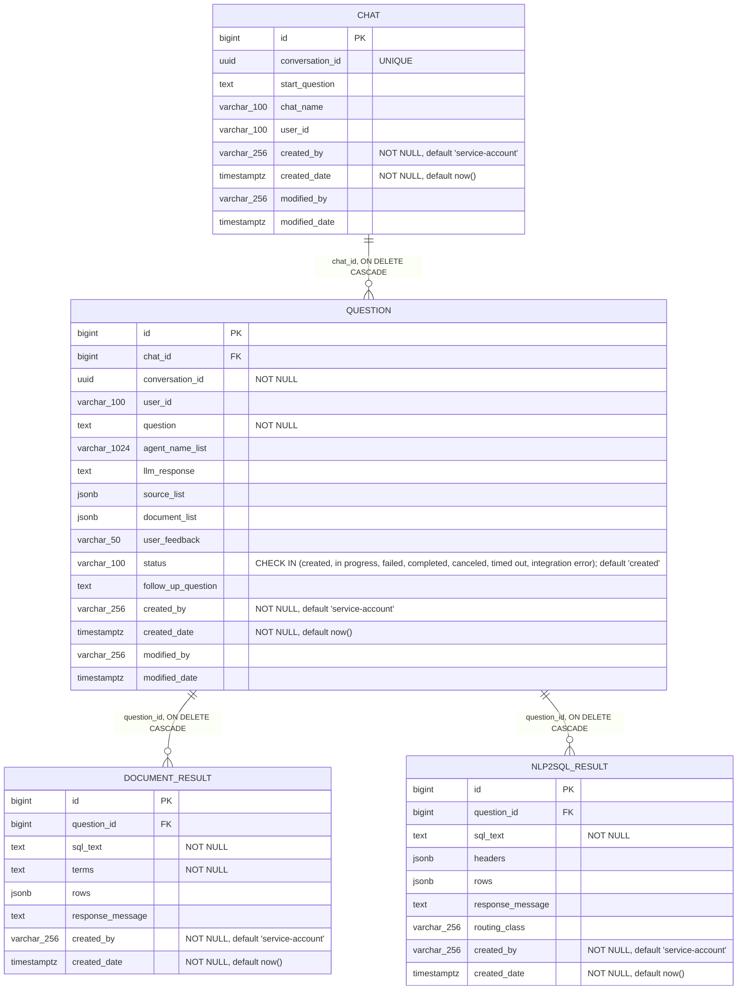

# DB Schema

Generated from the Liquibase DDL in `resources/liquibase/_01-schema`.
`resources/liquibase/_02-reference-data/reference-data.xml` has no active changesets
(everything in it is commented out), so it contributes no tables or data.

Notes:
- All tables live in the `assistant` schema; each PK is `bigserial` backed by an explicit `..._id_seq` sequence.
- Indexes: `chat(user_id, modified_date DESC)`; `question(conversation_id)`, `question(conversation_id, user_id, created_date ASC)`, `question(chat_id, user_id, created_date ASC)`; `nlp2sql_result(question_id)`, `document_result(question_id)`.
- `question.chat_id → chat.id`, `document_result.question_id → question.id`, `nlp2sql_result.question_id → question.id`, all `ON DELETE CASCADE`.
